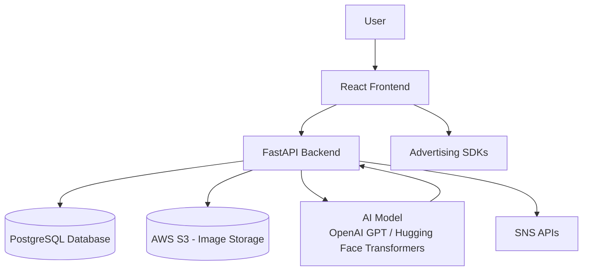
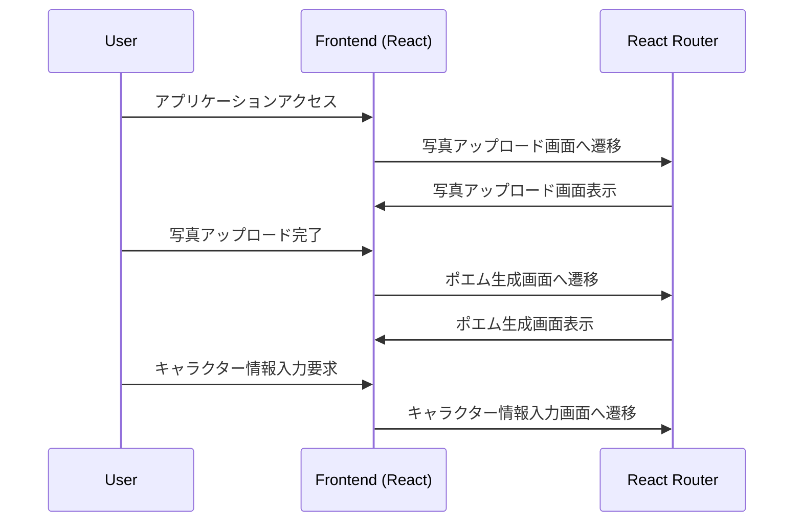
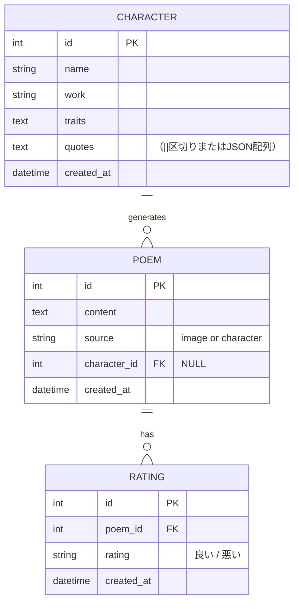

# システム設計書

この設計書は、要件定義書に基づいて作成されたポエム生成ツールの詳細設計を示します。本システムは、以下の機能を含みます。

- **フロントエンド (React) とバックエンド (FastAPI) の連携**
- **AWSクラウド上でのホスティングとDockerコンテナによる運用**
- **PostgreSQLを用いた詳細なデータベース設計 (ER図・スキーマ設計)**
- **OpenAI GPTおよびHugging Face Transformersを利用したAIモデル統合および学習プロセスの詳細**
- **SNS連携およびアフィリエイト広告を通じた収益化機能**

以下、各セクションごとに詳細を説明します。

---

## 1. システム全体のアーキテクチャ

### 1.1 コンポーネント概要

- **フロントエンド**: React.jsを用いたシングルページアプリケーション (SPA)
  - 状態管理: ReduxまたはContext API
  - スタイリング: Tailwind CSS または Material-UI
- **バックエンド**: FastAPI (Python)
  - REST APIエンドポイントの提供
  - PostgreSQL (AWS RDS) と連携するためのSQLAlchemy ORM
- **AIモデル統合**:
  - OpenAI GPTおよびHugging Face Transformersを利用して、画像やキャラクター情報に基づくポエム生成と微調整を実施
- **ストレージ**:
  - 画像はAWS S3に保存
- **クラウドインフラ**:
  - フロントエンド: AWS S3＋CloudFrontまたはAWS Amplify
  - バックエンド: AWS Fargate/EC2、データベースはAWS RDS (PostgreSQL)
- **コンテナ化**:
  - DockerおよびDocker Composeを利用し、フロントエンド、バックエンド、データベースコンテナを統合運用

### 1.2 システム連携図



この図は、各コンポーネント間の連携およびデータフローを示しています。

---

## 2. フロントエンド設計

### 2.1 技術スタック

- **React.js**: シングルページアプリケーションの開発
- **Redux/Context API**: 状態管理
- **Tailwind CSS / Material-UI**: スタイリング
- **React Router**: 画面遷移管理

### 2.2 コンポーネント概要と画面遷移

#### 主要画面

- **写真アップロード画面**:
  - ファイルドラッグ＆ドロップ機能
  - プレビュー表示
  - アップロードボタンにより`/upload-photo` APIを呼び出します
- **ポエム生成画面**:
  - 画像から生成されたポエム表示パネル
  - キャラクター情報から生成されたポエム表示パネル
  - 「良い」/「悪い」評価ボタン
- **キャラクター情報入力画面**:
  - キャラクター名、作品名、特徴、セリフを入力するフォーム
  - 入力内容プレビューと登録ボタンにより`/submit-character` APIを呼び出します
- **SNS連携画面**:
  - SNS投稿用共有ボタン
  - 各SNSのAPI（例: Twitter, Facebook）との連携を実装

#### 2.2.1 画面遷移図

以下の図は主要な画面の遷移を示します。



※ 現在、詳細なワイヤーフレームは未作成ですが、各画面のコンポーネントと状態遷移を明確に設計することが推奨されます。

---

## 3. バックエンド設計

### 3.1 技術スタック

- **FastAPI**: REST APIの構築
- **SQLAlchemy**: ORMを利用したPostgreSQLとの連携
- **PostgreSQL**: AWS RDS上に配置
- **AIモデル統合**: OpenAI GPTおよびHugging Face Transformers

### 3.2 APIエンドポイント設計一覧

| エンドポイント           | メソッド | 説明                                                           |
|--------------------------|----------|----------------------------------------------------------------|
| `/upload-photo`          | POST     | 写真アップロード。画像はAWS S3に保存。                          |
| `/generate-theme`        | POST     | 画像認識に基づいたテーマ抽出（ダミー実装）。                     |
| `/submit-character`      | POST     | ユーザー提供のキャラクター情報登録、学習データとして利用。        |
| `/generate-poem`         | POST     | 画像またはキャラクター情報に基づくポエム生成。                     |
| `/rate-poem`             | POST     | ユーザーが「良い」「悪い」でポエムを評価。                        |
| `/customize-poem`        | PUT      | 生成されたポエムの修正・更新。                                   |
| `/share-on-sns`          | POST     | SNS連携用データ生成、各SNS APIへの転送。                         |

#### 3.2.1 リクエスト・レスポンス例

- **写真アップロード**:
  - リクエスト: `multipart/form-data` (画像ファイル)
  - レスポンス例:

    ```json
    {
      "filename": "example.jpg",
      "location": "s3://bucket-name/path/example.jpg"
    }
    ```

- **ポエム生成**:
  - リクエスト: フォームパラメータにより`source` ("image" または "character")、画像情報、あるいはキャラクター情報が送信される
  - レスポンス例:

    ```json
    {
      "message": "ポエムが生成されました",
      "poem": {
        "id": 123,
        "content": "生成されたポエムの内容..."
      }
    }
    ```

---

## 4. AIモデルおよび学習プロセス

### 4.1 利用するモデル

- **OpenAI GPT**:
  - API経由でポエム生成の微調整やカスタマイズに利用
- **Hugging Face Transformers**:
  - ローカルまたはクラウド上で動作するモデルを使用
  - 事前学習済みのGPT-2等をファインチューニングしてキャラクター情報に特化したモデルを構築

### 4.2 モデル学習および微調整プロセス

1. **データ収集**:
   - ユーザーによるキャラクター情報、生成されたポエム、評価データを収集
2. **前処理**:
   - テキストのクレンジング、トークナイズ、データフォーマット (JSON, CSV) 化
3. **Fine-Tuning**:
   - Hugging FaceのTrainer APIを利用し、既存のGPT-2モデルをファインチューニング
   - 例:

     ```python
     from transformers import GPT2Tokenizer, GPT2LMHeadModel, Trainer, TrainingArguments

     tokenizer = GPT2Tokenizer.from_pretrained("gpt2")
     model = GPT2LMHeadModel.from_pretrained("gpt2")

     # データセットの前処理例
     train_dataset = ...

     training_args = TrainingArguments(
         output_dir="./results",
         num_train_epochs=3,
         per_device_train_batch_size=4,
     )

     trainer = Trainer(
         model=model,
         args=training_args,
         train_dataset=train_dataset
     )

     trainer.train()
     ```

4. **評価とフィードバックのループ**:
   - ユーザー評価 ("良い"/"悪い") を新たな学習データとして取り込み、定期的な再学習を実施

### 4.3 API連携

- ポエム生成エンドポイント内からAIモデルへ同期または非同期でリクエストし、生成結果を取得
- 例としてOpenAI GPT API呼び出し:

  ```python
  import openai

  openai.api_key = "YOUR_API_KEY"
  response = openai.Completion.create(
      engine="davinci",
      prompt="キャラクター情報から生成するポエムの例: ...",
      max_tokens=150
  )
  poem = response.choices[0].text.strip()
  ```

---

## 5. データベース設計

### 5.1 使用データベース

- **PostgreSQL** (AWS RDS上に展開)

### 5.2 エンティティおよびER図



### 5.3 スキーマ定義 (SQL例)

```sql
CREATE TABLE characters (
    id SERIAL PRIMARY KEY,
    name VARCHAR(100) NOT NULL,
    work VARCHAR(100) NOT NULL,
    traits TEXT NOT NULL,
    quotes TEXT,
    created_at TIMESTAMP DEFAULT CURRENT_TIMESTAMP
);

CREATE TABLE poems (
    id SERIAL PRIMARY KEY,
    content TEXT NOT NULL,
    source VARCHAR(50) NOT NULL, -- "image" または "character"
    character_id INTEGER REFERENCES characters(id),
    created_at TIMESTAMP DEFAULT CURRENT_TIMESTAMP
);

CREATE TABLE ratings (
    id SERIAL PRIMARY KEY,
    poem_id INTEGER REFERENCES poems(id),
    rating VARCHAR(20) NOT NULL,  -- "良い" もしくは "悪い"
    created_at TIMESTAMP DEFAULT CURRENT_TIMESTAMP
);
```

---

## 6. SNS連携およびアフィリエイト広告

### 6.1 SNS連携

- **対象SNS**: Twitter, Facebook, Instagram等
- **実装内容**:
  - 各SNSのAPI (OAuth認証、アクセストークン管理) を用いて投稿データを送信
  - エンドポイント `/share-on-sns` にて、生成ポエムと画像URLを各SNSへ転送
  - SNS APIとの連携ログやエラーハンドリングの実装

### 6.2 アフィリエイト広告配置

- フロントエンド画面 (写真アップロード画面、ポエム生成画面) に広告ブロックを設置
- 広告プロバイダー (Google AdSense、Amazonアソシエイト等) のJavaScript SDKを組み込み、広告の表示とクリック、表示回数のトラッキング機能を実装

---

## 7. デプロイメントおよびコンテナ化

### 7.1 DockerおよびDocker Compose

- **バックエンド (FastAPI)**:
  - Dockerfile を作成し、コンテナイメージをビルド
  - 例:

    ```dockerfile
    FROM python:3.9-slim
    WORKDIR /app
    COPY requirements.txt .
    RUN pip install --no-cache-dir -r requirements.txt
    COPY . .
    CMD ["uvicorn", "main:app", "--host", "0.0.0.0", "--port", "8000"]
    ```

- **フロントエンド (React)**:
  - Dockerfile を作成し、ビルド後にNginx等を利用して静的ファイルとして配信
- **Docker Compose**:
  - フロントエンド、バックエンド、PostgreSQLの各コンテナを連携する設定ファイルを用意

### 7.2 AWSへのデプロイメント

- **バックエンド**: AWS FargateまたはEC2で運用
- **フロントエンド**: AWS S3＋CloudFrontまたはAWS Amplifyによる静的ウェブホスティング
- **データベース**: AWS RDS for PostgreSQL
- **CI/CDパイプライン**: GitHub ActionsやAWS CodePipelineによる自動テスト・デプロイメントを実施

---

## 8. 補足事項

- **セキュリティ**:
  - 各APIエンドポイントに対するJWT認証等を検討
  - HTTPS通信の徹底およびAWS IAM、セキュリティグループ設定を適切に実施
- **スケーラビリティ**:
  - 高トラフィック時の自動スケール設計、キャッシュ機構の導入 (例: Redis)
- **ロギングとモニタリング**:
  - AWS CloudWatchを利用したログ管理とモニタリング
- **UI/UX**:
  - 詳細なワイヤーフレームは現在未作成のため、ユーザーテストを通して随時改善

---

この設計書は、作成済みのMermaidによる図を組み込み、システム全体の構成から細部のAPI、データベース設計、AI連携、SNS連携、コンテナ化、クラウドデプロイメントまでを詳細に説明しています。今後の実装フェーズにおいて、この設計書を基盤としてプロトタイプ開発およびユーザーテストを進めてください。
