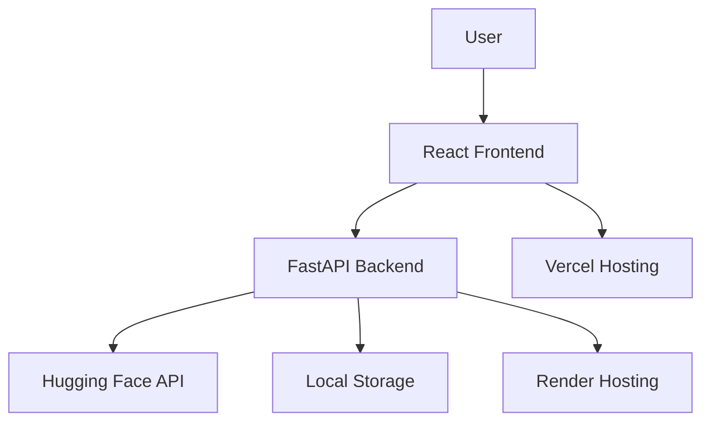

# システム設計書

この設計書は、要件定義書に基づいて作成されたポエム生成ツールの詳細設計を示します。本システムは、以下の機能を含みます。

- **フロントエンド (React) とバックエンド (FastAPI) の連携**
- **AWSクラウド上でのホスティングとDockerコンテナによる運用**
- **PostgreSQLを用いた詳細なデータベース設計 (ER図・スキーマ設計)**
- **OpenAI GPTおよびHugging Face Transformersを利用したAIモデル統合および学習プロセスの詳細**
- **SNS連携およびアフィリエイト広告を通じた収益化機能**

以下、各セクションごとに詳細を説明します。

---

## 1. システム全体のアーキテクチャ

### 1.1 コンポーネント概要

- **フロントエンド**: React.jsを用いたシングルページアプリケーション (SPA)
  - 状態管理: Context API
  - スタイリング: Material-UI
  - ルーティング: React Router v6
- **バックエンド**: FastAPI (Python)
  - REST APIエンドポイントの提供
  - Hugging Face APIとの連携
- **AIモデル統合**:
  - Hugging Face API（cyberagent/open-calm-7b）を利用
- **ストレージ**:
  - 画像はローカルストレージに保存
- **デプロイメント**:
  - フロントエンド: Vercel
  - バックエンド: Render

### 1.2 システム連携図



この図は、各コンポーネント間の連携およびデータフローを示しています。

---

## 2. フロントエンド設計

### 2.1 技術スタック

- **React.js**: シングルページアプリケーションの開発
- **Context API**: 状態管理
- **Material-UI**: スタイリング
- **React Router v6**: 画面遷移管理

### 2.2 コンポーネント構成

1. **PhotoUpload.js**
   - 写真アップロード機能
   - react-dropzoneを使用
   - プレビュー表示機能

2. **PoemGenerator.js**
   - ポエム生成と表示
   - 編集機能
   - 評価機能
   - SNS共有機能

3. **CharacterForm.js**
   - キャラクター情報入力フォーム
   - バリデーション機能

4. **Navbar.js**
   - ナビゲーション
   - 言語選択機能

5. **Footer.js**
   - フッター情報
   - リンク集

---

## 3. バックエンド設計

### 3.1 技術スタック

- **FastAPI**: REST APIの構築
- **Hugging Face API**: ポエム生成
- **Python-multipart**: ファイルアップロード処理

### 3.2 APIエンドポイント

1. `/upload-photo` (POST)
   - 写真アップロード
   - ローカルストレージに保存

2. `/submit-character` (POST)
   - キャラクター情報の登録

3. `/generate-poem` (POST)
   - 画像またはキャラクター情報からポエム生成
   - Hugging Face APIを使用

4. `/customize-poem` (PUT)
   - ポエムの編集

5. `/share-on-sns` (POST)
   - SNS共有機能

---

## 4. デプロイメント設計

### 4.1 フロントエンド（Vercel）

- ビルド設定
  ```json
  {
    "build": "react-scripts build",
    "output": "build"
  }
  ```

### 4.2 バックエンド（Render）

- 環境変数設定
  ```
  HUGGINGFACE_API_KEY=xxx
  ```

---

## 5. セキュリティ設計

### 5.1 CORS設定

```python
origins = [
    "http://localhost:3000",
    "https://poemgenerator-i3v6iijhh-suyako-tecks-projects.vercel.app",
    "https://poem-generator-app.vercel.app"
]

app.add_middleware(
    CORSMiddleware,
    allow_origins=origins,
    allow_credentials=True,
    allow_methods=["*"],
    allow_headers=["*"]
)
```

### 5.2 ファイルアップロード制限

- 許可するファイル形式: jpeg, jpg, png
- 最大ファイルサイズ: 5MB

---

## 6. エラーハンドリング

### 6.1 フロントエンド

- アップロードエラー
- 生成エラー
- ネットワークエラー

### 6.2 バックエンド

- ファイル処理エラー
- API呼び出しエラー
- バリデーションエラー

---

## 7. パフォーマンス最適化

### 7.1 フロントエンド

- 画像の最適化
- コンポーネントの遅延ロード
- キャッシュの活用

### 7.2 バックエンド

- 非同期処理
- エラーログの記録
- レスポンスの最適化

---

この設計書は、作成済みのMermaidによる図を組み込み、システム全体の構成から細部のAPI、データベース設計、AI連携、SNS連携、コンテナ化、クラウドデプロイメントまでを詳細に説明しています。今後の実装フェーズにおいて、この設計書を基盤としてプロトタイプ開発およびユーザーテストを進めてください。
